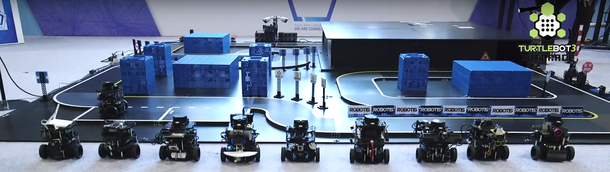
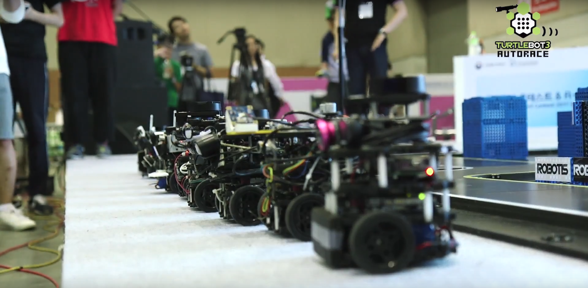

.. _chapter_autonomous_driving:

Autonomous Driving
==================

.. NOTE:: This instruction was tested on ``Ubuntu 16.04`` and ``ROS Kinetic Kame``.

We are currently doing several projects related with the keywords: Autonomous Driving and TurtleBot3s

TurtleBot3 Auto
------------------

In the video, TurtleBot3 gets its eye by attaching a $40 Raspberry Pi Camera and adopts open source from MIT DuckieTown engineering to track the lane.

.. raw:: html

  <iframe width="640" height="360" src="https://www.youtube.com/embed/1V33iEu4ylw" frameborder="0" allowfullscreen></iframe>

and soon (In January, 2018), official autonomous driving package for turtlebot3 will be released.

Joined in AutoRace
-------------------

AutoRace is a competition for autonomous driving robot platforms. To provide various conditions for robot application development, the game gives as less structural regulation as possible. Entire contents are opened in software (source codes for referee system) wise and hardware (stp / dwg files of game map) wise.
Whole robots and even the referee system in the field is run by ROS, so it would support to make many kinds of contents further.

Get opened source of what is participated in each competitions!

AutoRace - RBIZ Challenge 2017
~~~~~~~~~~~~~~~~~~~~~~~~~~~~~~

- Details of track map and referee system (with sources provided)

track map : https://github.com/ROBOTIS-GIT/autorace_track

referee system : https://github.com/ROBOTIS-GIT/autorace_referee

- Participants sources

+-------+------------------------------------+----------------------------------------------------------+
| Place | Team                               | Source link                                              |
+=======+====================================+==========================================================+
|   1   | RealRiceThief                      | https://github.com/KoG-8/Turtlebot_RealRiceThief         |
+-------+------------------------------------+----------------------------------------------------------+
|   2   | IronHeart                          | https://github.com/kijongGil/Ironheart                   |
+-------+------------------------------------+----------------------------------------------------------+
|   3   | Robit                              | https://github.com/ROBIT-GIT/turtlebot3_autoRace_2017    |
+-------+------------------------------------+----------------------------------------------------------+
|   4   | Loading                            | https://github.com/Kihoon0716/self_driving_turtlebot3    |
+-------+------------------------------------+----------------------------------------------------------+
|   5   | RunHoney                           | https://github.com/hyunoklee/turtlebot3_RBIZ             |
+-------+------------------------------------+----------------------------------------------------------+
|   6   | Sherlotics                         | https://github.com/minbaekkim/turtlebot_autorace         |
+-------+------------------------------------+----------------------------------------------------------+
|   7   | FastAndFurious                     | https://github.com/kts006/deu_racer                      |
+-------+------------------------------------+----------------------------------------------------------+
|   8   | BonoBono                           | https://github.com/Gaeul/BonobonoTurtlebot               |
+-------+------------------------------------+----------------------------------------------------------+
|   9   | BeginAgain                         | https://github.com/yh-na/beginagain                      |
+-------+------------------------------------+----------------------------------------------------------+
|   10  | Hanzo                              | https://github.com/DeokYun/autorace                      |
+-------+------------------------------------+----------------------------------------------------------+
|   11  | Codis                              | will be released soon                                    |
+-------+------------------------------------+----------------------------------------------------------+
|   12  | Zero                               | https://github.com/dongwan123/zero_turtlebot_competition |
+-------+------------------------------------+----------------------------------------------------------+
|   13  | CanDynamix                         | https://github.com/candynamix/can_dynamix                |
+-------+------------------------------------+----------------------------------------------------------+
|   14  | Cena                               | retire                                                   |
+-------+------------------------------------+----------------------------------------------------------+
|   15  | TogetherChaChaCha                  | retire                                                   |
+-------+------------------------------------+----------------------------------------------------------+

- Videos

Teaser #1

.. raw:: html

  <iframe width="560" height="315" src="https://www.youtube.com/embed/9Wnu8If1eS4" frameborder="0" allowfullscreen></iframe>

Teaser #2

.. raw:: html

  <iframe width="560" height="315" src="https://www.youtube.com/embed/47YnSBAssOM" frameborder="0" allowfullscreen></iframe>

Final video

.. raw:: html

  <iframe width="560" height="315" src="https://www.youtube.com/embed/DWDBAHHQi_k" frameborder="0" allowfullscreen></iframe>

Video - Team RealRiceThief (1st Place)

.. raw:: html

  <iframe width="560" height="315" src="https://www.youtube.com/embed/szhllE1T_cg" frameborder="0" allowfullscreen></iframe>

Video - Team Sherlotics (Introduction video)

.. raw:: html

  <iframe width="560" height="315" src="https://www.youtube.com/embed/dzjsLFj62HE" frameborder="0" allowfullscreen></iframe>

AutoRace - now on scheduling for competition 2018
~~~~~~~~~~~~~~~~~~~~~~~~~~~~~~

If you want to hold the competition in where you are, let us help you.

Please ask contactus@robotis.com

|
