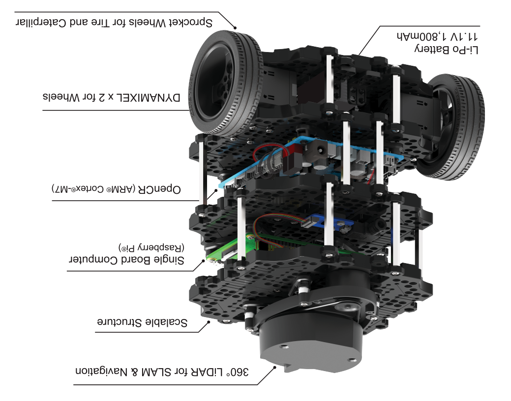

.. _chapter_hardware_setup:

Hardware Setup
==============

.. image:: _static/hardware/turtlebot3_models_rd2.png

Main Components
---------------

.. image:: _static/hardware/turtlebot3_waffle_components.png

Part List
---------

TurtleBot3 has two different models: ``Burger`` and ``Waffle``. The following list shows their components. The big differences between two models are the Motor, the SBC(Single Board Computer) and the Sensors.

+---------------+--------------------------------+--------+---------+
| The number of the parts of each model          | Burger | Waffle  |
+===============+================================+========+=========+
|               | Waffle-Plate                   | 8      | 24      |
+               +--------------------------------+--------+---------+
|               | Plate Support M3x35mm          | 4      | 12      |
+               +--------------------------------+--------+---------+
|               | Plate Support M3x45mm          | 10     | 10      |
+               +--------------------------------+--------+---------+
| Chasis        | PCB Support                    | 12     | 12      |
+               +--------------------------------+--------+---------+
|               | Wheel                          | 2      | 2       |
+               +--------------------------------+--------+---------+
|               | Tire                           | 2      | 2       |
+               +--------------------------------+--------+---------+
|               | Ball Caster                    | 1      | 2       |
+---------------+--------------------------------+--------+---------+
|               | DYNAMIXEL (XL430-W250-T)       | 2      | 0       |
+ Motor         +--------------------------------+--------+---------+
|               | DYNAMIXEL (XM430-W210-T)       | 0      | 2       |
+---------------+--------------------------------+--------+---------+
|               | OpenCR                         | 1      | 1       |
+               +--------------------------------+--------+---------+
|               | Raspberry Pi 3                 | 1      | 0       |
+ Board         +--------------------------------+--------+---------+
|               | Intel® Joule™                  | 0      | 1       |
+               +--------------------------------+--------+---------+
|               | USB2LDS                        | 1      | 1       |
+---------------+--------------------------------+--------+---------+
|               | HLS-LFCD2                      | 1      | 1       |
+ Sensor        +--------------------------------+--------+---------+
|               | Intel® Realsense™ R200         | 0      | 1       |
+---------------+--------------------------------+--------+---------+
| Memory        | MicroSD Card                   | 1      | 0       |
+---------------+--------------------------------+--------+---------+
|               | Raspberry Pi 3 Power Cable     | 1      | 0       |
+               +--------------------------------+--------+---------+
|               | Intel® Joule™ Power Cable      | 0      | 1       |
+               +--------------------------------+--------+---------+
| Cable         | Li-Po Battery Extension Cable  | 1      | 1       |
+               +--------------------------------+--------+---------+
|               | DYNAMIXEL to OpenCR Cable      | 2      | 2       |
+               +--------------------------------+--------+---------+
|               | USB Cable                      | 2      | 2       |
+---------------+--------------------------------+--------+---------+
|               | SMPS 12V5A                     | 1      | 1       |
+               +--------------------------------+--------+---------+
| Power         | A/C Code                       | 1      | 1       |
+               +--------------------------------+--------+---------+
|               | LIPO Battery 11.1V 1800mAh     | 1      | 1       |
+---------------+--------------------------------+--------+---------+
|               | Screw driver                   | 1      | 1       |
+               +--------------------------------+--------+---------+
|               | Rivet tool                     | 1      | 1       |
+ Tool          +--------------------------------+--------+---------+
|               | USB3.0 HUB                     | 0      | 1       |
+               +--------------------------------+--------+---------+
|               | LIPO Battery charger           | 1      | 1       |
+---------------+--------------------------------+--------+---------+
|               | PH_M2x4mm_K                    | 8      | 8       |
+               +--------------------------------+--------+---------+
|               | PH_T2x6mm_K                    | 4      | 8       |
+               +--------------------------------+--------+---------+
|               | PH_M2x12mm_K                   | 0      | 4       |
+               +--------------------------------+--------+---------+
|               | PH_M2.5x8mm_K                  | 16     | 12      |
+               +--------------------------------+--------+---------+
|               | PH_M2.5x12mm_K                 | 0      | 18      |
+               +--------------------------------+--------+---------+
|               | PH_T2.6x12mm_K                 | 16     | 0       |
+               +--------------------------------+--------+---------+
|               | PH_M2.5x16mm_K                 | 4      | 4       |
+ Part          +--------------------------------+--------+---------+
|               | PH_M3x8mm_K                    | 44     | 140     |
+               +--------------------------------+--------+---------+
|               | NUT_M2                         | 0      | 4       |
+               +--------------------------------+--------+---------+
|               | NUT_M2.5                       | 20     | 18      |
+               +--------------------------------+--------+---------+
|               | NUT_M3                         | 16     | 96      |
+               +--------------------------------+--------+---------+
|               | Rivet_1                        | 14     | 20      |
+               +--------------------------------+--------+---------+
|               | Spacer                         | 4      | 4       |
+               +--------------------------------+--------+---------+
|               | Bracket                        | 5      | 8       |
+               +--------------------------------+--------+---------+
|               | Adapter Plate                  | 1      | 1       |
+               +--------------------------------+--------+---------+
|               | Rivet_2                        | 2      | 2       |
+---------------+--------------------------------+--------+---------+

Assembly Manual
---------------

TurtleBots3 is delivered as unassembled parts in the boxes. Follow the instructions to assemble TurtleBot3.

TurtleBot3 Burger
~~~~~~~~~~~~~~~~~

:download: `Assembly manual for TurtleBot3 Burger [PDF]`_

TurtleBot3 Waffle
~~~~~~~~~~~~~~~~~

:download: `Assembly manual for TurtleBot3 Waffle [PDF]`_

Assembly Video
--------------

If it is difficult to assemble with the assembly manual, please refer to the following assembly video.

TurtleBot3 Burger
~~~~~~~~~~~~~~~~~

.. raw:: html

  <iframe width="640" height="360" src="https://www.youtube.com/embed/rvm-m2ogrLA" frameborder="0" allowfullscreen></iframe>

|

TurtleBot3 Waffle
~~~~~~~~~~~~~~~~~

.. raw:: html

  <iframe width="640" height="360" src="https://www.youtube.com/embed/1nTMyr4ybi0" frameborder="0" allowfullscreen></iframe>

|

Basic Operation
---------------

.. image:: _static/hardware/opencr_models.png

You can use ``PUSH SW 1`` and ``PUSH SW 2`` buttons to see whether your robot has been properly assembled. This process tests the left and right DYNAMIXELs and the OpenCR board.

1. After assembling TurtleBot3, connect the battery to OpenCR and turn on the power switch. You can see that the ``Power LED`` of OpenCR turns on.
2. Place the robot on the floor. For the test, safety radius of 1 meter (about 40 inches) is recommended.
3. Press and hold ``PUSH SW 1`` for a few seconds to command the robot to move 30 centimeters (about 12 inches) forward.
#. Press and hold ``PUSH SW 2`` for a few seconds to command the robot to rotate 180 degrees in place.

Open Source Hardware
--------------------

Core components of Turtlebot3 are the followings: Chassis, Motors, Wheels, OpenCR, SBC Computer, Sensor and Battery. The chassis are Waffle Plates that holds other components. The Waffle Plate plays an important role as a chassis although its size is as small as your palm. Waffle plate is manufactured with injection mold method to lower the manufacturing cost. However, the CAD data of waffle plate for 3D printing is also available via `Onshape`_. Turtlebot3 Burger is a Two-wheeled differential drive type platform, but it is customizable structurally and mechanically in many ways: Cars, Bikes, Trailers and so on.

The CAD data is released to the `Onshape`_, which is a full-cloud 3D CAD editor. Get access through a web browser from your PC or from portable devices. OnShape allows drawing and assemblying parts with co-workers.

- TurtleBot3 Burger 3D Model: https://goo.gl/n3bGNr
- TurtleBot3 Waffle 3D Model: https://goo.gl/wCDvVI

.. _Assembly manual for TurtleBot3 Burger [PDF]: https://drive.google.com/file/d/0B8u1-N9yBAQoOVZDZGI4dDNPdjQ/view?usp=sharing
.. _Assembly manual for TurtleBot3 Waffle [PDF]: https://drive.google.com/file/d/0B8u1-N9yBAQoTVNVcjYtSE1iQWc/view?usp=sharing
.. _Onshape: https://cad.onshape.com/documents?filter=recently-opened&column=modifiedAt&order=desc&viewMode=0&q=turtlebot3
